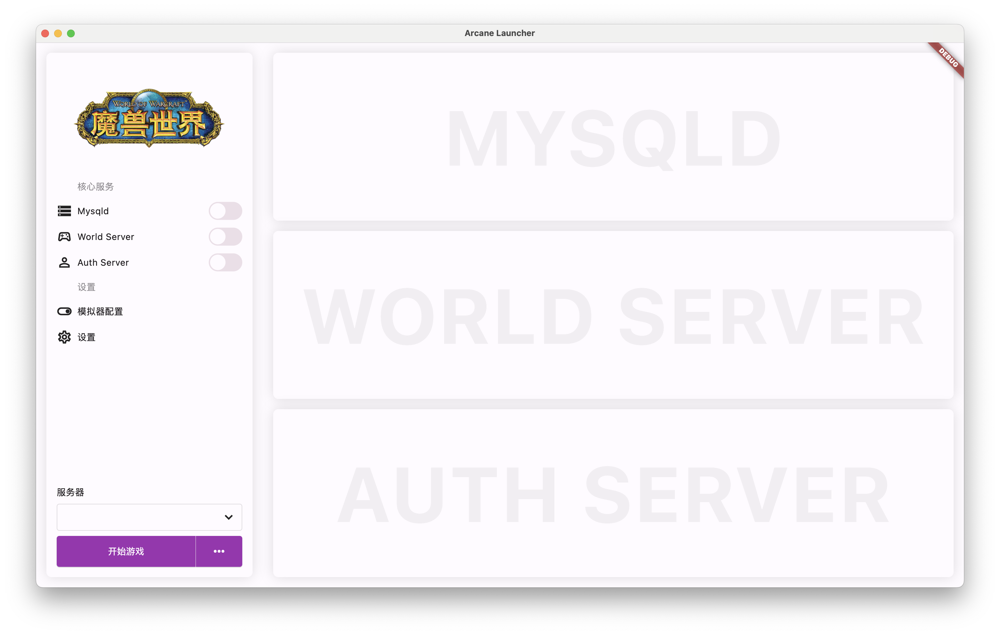

# Arcane Launcher

You can start game easily cause arcane integrate all services needed.

## Preview

## Install

1. First, you should open the setting page and add a new server which contains the services you need to start a game
2. Then, back to launcher page and click the start game button.
3. And all you need now, is waiting for the launcher starting services.
